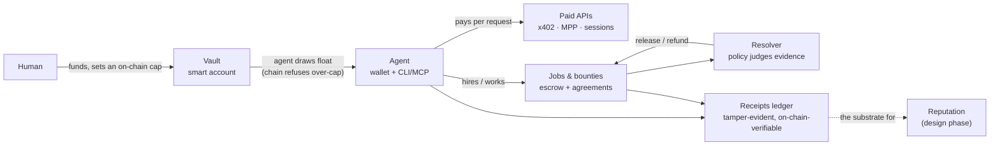
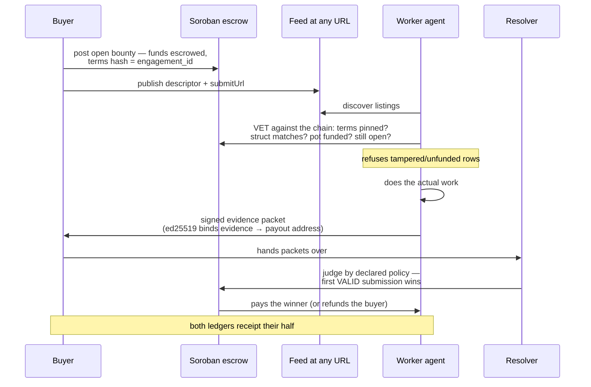
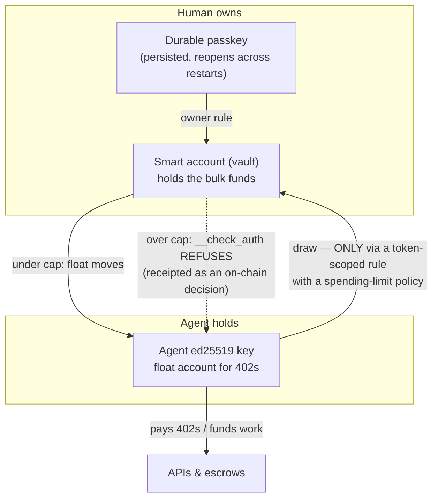

<p align="center"><b>stellar-pay</b></p>
<p align="center"><b>The neutral, self-custody layer for human-to-agent work on Stellar — an agent CLI and a toolkit.</b></p>
<p align="center">
  <a href="https://www.npmjs.com/package/stellar-pay"></a>
  <a href="https://github.com/Stellar-Light/stellar-pay/blob/main/LICENSE"></a>
  <a href="https://github.com/Stellar-Light/stellar-pay/actions/workflows/probe.yml"></a>
</p>
<p align="center"><a href="#try-it-now">Try it</a> · <a href="#-pay-for-any-api">Pay</a> · <a href="#-the-work-layer-testnet">Work</a> · <a href="#-fund-an-agent-the-vault-testnet">Fund</a> · <a href="#-a-catalog-thats-evidence-not-a-listing">Catalog</a> · <a href="#-for-agents-mcp-claude-code-raven">Agents</a> · <a href="#the-benchmark-we-hold-ourselves-to">Benchmark</a> · <a href="#not-built-yet--and-why">Not built yet</a></p>

---

Before agent-to-agent commerce goes mainstream, **human-to-agent commerce is
the wedge**: people paying agents to complete real work. That takes more than
a payment rail — it takes funding an agent safely, hiring one you don't
trust, verifying what it did, paying on the verdict, and keeping evidence of
all of it. stellar-pay is that loop as a CLI, an MCP server, and a library —
neutral (no gateway, no operator's cut) and self-custody (your keys, caps
enforced by the chain, not by a platform's servers).



Every box is testnet-proven with on-chain checks (see
[Proof you can run](#-proof-you-can-run)); the payment client and catalog also
run on mainnet. Direction and the quality bar live in
[`docs/SPINE.md`](docs/SPINE.md).

## Try it now

A real on-chain payment, with play money, in three commands:

```sh
export STELLAR_PAY_PASSPHRASE=sandbox   # testnet play money; any value works
npx stellar-pay setup --sandbox --save sandbox                 # funded testnet wallet, sealed locally
npx stellar-pay curl https://stellar-pay-sandbox.fly.dev/data --yes --sandbox
```

That settles on Stellar testnet for real — the output carries the
stellar.expert link. No real funds, no signup, nothing installed. The
[sandbox](https://stellar-pay-sandbox.fly.dev/) is our own paid endpoint,
priced in native XLM so a friendbot-funded wallet can pay it immediately (no
trustline, no faucet) with the seller sponsoring fees.

Or read a live MAINNET 402 without a wallet, spending nothing:

```sh
npx stellar-pay offers https://apiserver.mpprouter.dev/v1/services/exa/search -X POST -d '{"query":"stellar"}'
```

Or hand the whole toolkit to an agent:

```sh
npx stellar-pay claude   # Claude Code with the payment + work tools mounted
```

## 💵 Pay for any API

Both live Stellar payment standards, one client:

- **x402** — the `exact` scheme
  ([spec](https://github.com/x402-foundation/x402/blob/main/specs/schemes/exact/scheme_exact_stellar.md)),
  settled through a facilitator.
- **MPP, Stellar charge method** —
  [draft-stellar-charge-00](https://paymentauth.org/draft-stellar-charge-00),
  SDF's spec. No facilitator; the server settles.

On a 402, stellar-pay reads the price, token, recipient and network from the
challenge and signs **authorization entries**, not a whole transaction — the
server (or its facilitator) assembles, submits, and pays the fee. Your wallet
holds USDC and nothing else: no XLM, no sequence numbers, no RPC.

```sh
stellar-pay offers <url>                      # what the 402 asks — pays nothing
stellar-pay curl   <url>                      # asks you, pays, returns the answer
stellar-pay curl   <url> --yes --max-usd 0.05 # unattended, under a ceiling
stellar-pay verify <url>                      # seller check: is your 402 correct and Stellar-payable?
```

**Router-agnostic by design.** A router (like
[mpp-router](https://www.mpprouter.dev/)) proxies many APIs behind one gateway
and takes the payment itself — real supply, and the largest source in our
catalog. stellar-pay sits above all of them: it pays *any* host from the
**user's own wallet** — mpp-router, the x402 Bazaar, a provider serving its
own 402 — with no gateway in the middle, no operator's cut, no lock-in.

### Sessions: pay per call, off-chain (testnet)

Per-request settlement is the floor. For a busy agent loop, a **one-way
payment channel** deposits once and then pays each call with an off-chain
signed commitment — measured ~10× faster per call, and the deposit is your
maximum exposure to that seller, enforced by the channel contract:

```sh
stellar-pay session open <url> --deposit 5   # one on-chain deposit (default 5 XLM)
stellar-pay curl <url> --session             # each call pays OFF-CHAIN
stellar-pay session status                   # cumulative committed, per host
stellar-pay session close <url>              # settle; the funder's refund is verified
```

The client's cumulative baseline persists across restarts, so a replayed
process can't be tricked into re-signing from zero.

### Wrap any tool — `stellar-pay run`

`curl` pays for requests you make. `run` pays for requests made by a tool we
didn't write — curl, a Python script, another agent's client:

```sh
stellar-pay run --yes --max-usd 0.05 -- curl -X POST https://apiserver.mpprouter.dev/v1/services/exa/search -d '{"query":"stellar"}'
stellar-pay run -- python my_script.py        # any command; its 402s get paid
```

It starts a localhost proxy, points the child at it (`HTTPS_PROXY` + a local
CA the child alone trusts, never installed system-wide), and routes every
request through the same pay loop: on a 402 it reads the offer, pays, retries
— the tool just sees the 200. The proxy is gated by a per-run auth token, its
CA key lives only in memory, and it dies with the command.

## 🤝 The work layer (testnet)

Paying per-request is half the thesis. The other half is **work**: hiring an
agent you don't trust, or earning as one. Money escrows before work starts,
the terms are pinned by hash on-chain, evidence is judged by a declared
policy, and payment follows the verdict — no platform in the middle.



**Hire** (the buyer side):

```sh
stellar-pay bounty post --title "verify 3 rows" --items a,b,c \
  --instructions "…" --amount-xlm 1 --resolver G… --submit-url https://… --out bounty.json
stellar-pay bounty open bounty.json        # escrow + fund — BEFORE a winner exists
stellar-pay bounty assign bounty.json --provider G…   # or: directed at one worker
stellar-pay bounty resolve bounty.json --contract C… --submissions s1.json,s2.json
```

**Earn** (the worker side):

```sh
stellar-pay bounty list --from <feed-url>       # vet every listing against the CHAIN
stellar-pay bounty pack --contract C… --evidence ev.json --send --to <submitUrl>
stellar-pay bounty watch --contract C…          # did WE get paid? receipted as income
```

What makes this trustworthy without a platform:

- **Agreements are chain-pinned.** Terms live in a hash-committed document
  (`stellar-pay/agreement-v1`); its sha256 **is** the escrow's engagement id.
  A worker re-derives the terms from the descriptor alone and checks the
  hash against the chain — a feed that lies about pay or scope is caught
  before any work is spent (proven: the e2e feeds the worker a tampered
  descriptor claiming 10× the pot; it is refused).
- **Funded means funded.** The vet asks the *token contract* what the escrow
  actually holds — not the terms, not the feed.
- **Evidence is bound to its author.** Submissions are ed25519-signed over
  `sha256(contractId | evidence)` — re-submitting someone else's work under
  your own payout address fails the signature check (proven in a live race).
  The honest limit, asserted in that same test: a thief who *obtains* the
  evidence can re-sign it under their own key, so evidence is sent to the
  resolver rather than the buyer, and commit-reveal is listed below as the
  real fix.
- **Judgments are declared and receipted.** The resolver runs the policy the
  agreement names (deterministic schema/coverage checks, hash match, or a
  delegated judge), and every judgment lands in the ledger with the policy
  label and the evidence it saw.
- **Escrow rails are a commodity we rent**, behind a swappable seam
  ([`src/pay/rails.ts`](src/pay/rails.ts)). Today: [Trustless
  Work](https://www.trustlesswork.com/)'s live Soroban escrow, integrated
  keyless (straight at the contract — no API key; their 0.3% protocol fee
  applies on settlement). If SDF ships a native escrow primitive, adopting it
  is one new file, not a rewrite.

Jobs without the bounty wrapper (`openJob`/`fundJob`/`deliverJob`/…) are the
library's lower layer — same escrow, same agreements, custom terms.

## 🔐 Fund an agent: the vault (testnet)

Handing an agent a funded key is how budgets die. The vault inverts custody:
**bulk funds live in a smart account the human owns; the agent's key can only
draw float under a cap the chain enforces.**



```sh
stellar-pay vault create --cap-xlm 5    # deploy; owner = durable passkey, agent = THIS wallet
stellar-pay vault topup --amount-xlm 20 # bulk funds behind the cap (a plain SAC transfer)
stellar-pay vault draw  --amount-xlm 2  # agent pulls float; over-cap → REFUSED BY THE CHAIN
stellar-pay vault status
```

The contrast that matters, stated precisely: a hosted platform's spending
limit is a **policy promise** enforced by its own servers — Circle's is a good
one, and their MPC wallets are not simply "they hold your keys". Ours is a
**property of the contract** (`__check_auth`): the refusal is a transaction
anyone can verify, and it holds even if every server we run disappears. Proven
end-to-end: create → topup → draw → *pay a real 402 from the drawn float* →
over-cap draw refused on-chain → reopen from persistence
([`test:vault-flow`](src/sandbox/vault-flow-test.ts)). Built on SDF's
[smart-account-kit](https://github.com/stellar/smart-account-kit) and
OpenZeppelin's contracts — we author no Soroban contracts, anywhere.

## 🧾 Receipts: the evidence substrate

Every step above — payments, refusals, jobs, judgments, bounty income, vault
draws — lands in a local, content-addressed ledger:

```sh
stellar-pay receipts                    # the ledger
stellar-pay receipts check              # tamper check: every id must re-derive from its content
stellar-pay receipts --verify <id>      # prove a row against Horizon (tx + credited effects)
```

Row ids are sha256 of the row's content, refs chain rows into attributions
(open → fund → deliver → resolved), and `--verify` re-derives a payment from
the chain. This ledger is deliberately the substrate reputation will be built
from — see [Not built yet](#not-built-yet--and-why).

## 🔍 A catalog that's evidence, not a listing

Registries list endpoints that died months ago, and "supports x402" says
nothing about Stellar: the same standard runs on Base, Solana and Polygon,
and most servers name only those. Measured 2026-08 from the x402 Bazaar: of
its ~1,611 hosts, **three** named `stellar:pubnet`. A listing is not supply.

So the catalog probes instead of trusting. An entry appears in the default
view only if it **answered a real 402, on a network this catalog claims, and
was re-probed within the last 48 hours** — carrying its price, protocol, the
method that produced the challenge, the networks it actually named, and how
long it has been alive. (48 hours, not 24, so a single missed daily probe is
not an outage. The one deliberate exception is our own testnet sandbox,
marked `curated`, so newcomers have something to pay.) About **390 endpoints**
qualify today across the x402 Bazaar and mpp-router.

Being in the catalog means it **answered a Stellar 402 at the last probe** —
strictly better than a registry listing, and still short of a guarantee.
Roughly **8% of live rows fail a strict check** (`stellar-pay verify <url>`
is the same validator our probe uses, and the honest second opinion): a host
can rotate its price, change asset, or go down between probes. The live 402
is always the authority — `curl` re-reads it and pins the payment to what you
approved, so a stale row costs you a refusal, never a wrong payment.

Using the catalog needs no secret — it's a public feed anyone can pull:

```
https://raw.githubusercontent.com/Stellar-Light/stellar-pay/catalog/catalog.json
```

The daily job publishes the snapshot to the `catalog` branch; the client
fetches that URL over plain HTTPS — no token, no account. Aggregators and
other agents are welcome to ingest it — every row carries its evidence.

## 🤖 For agents: MCP, Claude Code, Raven

```sh
stellar-pay claude            # Claude Code with stellar-pay mounted
stellar-pay codex             # Codex with stellar-pay mounted
claude mcp add stellar-pay -- stellar-pay mcp   # or register it yourself
stellar-pay mcp               # raw stdio server for Cursor, goose, or your own client
```

**26 tools**, grouped by job:

| group | tools |
|---|---|
| discover & pay | `search_catalog`, `get_catalog_entry`, `list_catalog`, `curl` |
| wallet | `get_balance`, `send_usdc` (two-step confirm, single-use server nonce), `get_history` |
| governance | `begin_task` / `end_task`, `spend_report` |
| sessions | `session_open`, `session_status`, `session_close` (+ `curl{session:true}`) |
| hire | `bounty_post`, `bounty_assign`, `bounty_open`, `bounty_dispute`, `bounty_resolve`, `bounty_status` |
| earn | `bounty_feed`, `bounty_pack`, `bounty_submit` (directed), `bounty_submit_packet`, `bounty_watch` |
| fund | `vault_draw`, `vault_status` |

The agent-facing playbook — including the **Earning** loop — is
[`skills/stellar-pay/SKILL.md`](skills/stellar-pay/SKILL.md).

**Who approves what:** the CLI asks a human before it signs (or `--yes
--max-usd N` to authorize unattended); the MCP signs only within a spending
policy — on mainnet a payment must be USDC, under a per-call ceiling
(`STELLAR_PAY_MAX_USD_PER_CALL`), and inside a session budget
(`STELLAR_PAY_SESSION_BUDGET_USD`). When the MCP client supports
**elicitation**, a payment the policy refuses *on price* is put to the person
driving the agent rather than failing silently; a denied host or a network
mismatch is never escalated, because those are operator decisions or attacks,
not judgement calls. Agent-reachable URLs (`curl`, `session_open`,
`bounty_feed`, `bounty_submit_packet`) all pass one SSRF guard —
loopback/private/link-local targets are refused.

**Per-host spend policy.** Beyond the flat ceiling, an optional policy file
(`~/.config/stellar-pay/policy.json`, `stellar-pay policy init` to scaffold)
gives an operator per-host control the flat cap can't — a different ceiling
per host, an outright **deny**, or **allowlist mode** where only listed hosts
are payable at all. It applies to every door (CLI `curl`, `run`, and the MCP):

```json
{
  "mode": "denylist",
  "default": { "maxUsdPerCall": 0.05 },
  "hosts": {
    "apiserver.mpprouter.dev": { "maxUsdPerCall": 0.10 },
    "*.trusted-provider.com": { "maxUsdPerCall": 0.50 },
    "sketchy.example.net": { "deny": true }
  }
}
```

A host rule can raise or lower the ceiling; an explicit `--max-usd` only ever
tightens it. In `allowlist` mode an autonomous agent can pay **only** the
hosts you pre-approved.

**Spend governance — pay for what's used, not what's asked.** Inside a task,
[Scrimp](https://github.com/kaankacar/scrimp) (by Kaan Kacar, vendored with
permission) adds outcome-attributed control a budget cap can't match: a
request already bought in this task is **replayed free**; one re-fetched
inside its freshness window is replayed free; a provider that just failed
repeatedly is **quarantined**; every purchase is labelled **wasted** if its
response was never read. `spend_report` shows spend versus what an ungoverned
client would have paid.

**Raven.** [Raven](https://github.com/stellar-experimental/stellar-raven) is
the Stellar ecosystem's agent gateway — one MCP that routes an agent's
question to the right Stellar service. stellar-pay mounts the same way:
catalog search through Raven's routing, paid calls through a wallet under the
same spend governance.

## 💼 Wallet

```sh
stellar-pay setup --save main                 # new wallet, sealed in an encrypted local keystore
stellar-pay topup                             # get USDC in: QR + address + live on-ramps; waits for the deposit
stellar-pay balance                           # USDC + XLM at a glance
stellar-pay send <G...address|name> --amount 1.5   # send USDC (confirms first); --amount max drains
stellar-pay account export --name main backup.json # 0600 backup; import restores it
stellar-pay history                           # recent payments to/from the wallet
```

The key never sits in plaintext: the keystore seals it with AES-256-GCM under
a passphrase (`STELLAR_PAY_PASSPHRASE` for agents and the MCP, an interactive
prompt for humans), or `--keychain` keeps it in the macOS Keychain — written
over stdin, so it never appears in the process table. Unlocking a
`--keychain` wallet requires **Touch ID** (or the login password).
`account list / import / default / remove / export` manage saved wallets.

`STELLAR_SECRET_KEY` in the environment still wins when set — handy in CI and
for throwaway testnet keys, but it leaves a raw secret in your shell, so
prefer the keystore for anything funded. `run` and the agent launchers strip
it from the commands they spawn.

`topup` shows a SEP-7 QR any mobile Stellar wallet scans (Lobstr, Freighter),
and on mainnet lists live fiat on-ramps — MoonPay card/PayPal, Lobstr, Rozo,
exchange-withdraw routes (Coinbase, Kraken — buy then **withdraw on the
Stellar network**), the Rozo Intent Bridge for USDC you hold on other chains,
and fiat anchors (MoneyGram cash→USDC and more) pulled live from Stellar
Light's partner directory. `topup --buy` opens a card on-ramp pre-filled and
waits for the USDC to land.

## Using stellar-pay

Each row links to its section — full flags there, not a pointer to the pitch.

| | |
|---|---|
| **[Pass-through commands](#pass-through-commands)** | `curl`, `offers`, and `run -- <anything>` |
| **[Sessions](#sessions-pay-per-call-off-chain-testnet)** | `session open/status/close`, `curl --session` |
| **[The work layer](#-the-work-layer-testnet)** | `bounty post/assign/open/list/pack/submit/dispute/resolve/watch/status` |
| **[The vault](#-fund-an-agent-the-vault-testnet)** | `vault create/topup/draw/status` |
| **[Receipts](#-receipts-the-evidence-substrate)** | `receipts`, `receipts check`, `--verify` |
| **[Manage accounts](#-wallet)** | `setup --save`, the `account` family, `--account`, `send`, `history` |
| **[Find things to pay for](#find-things-to-pay-for)** | `search` over the daily-probed catalog |
| **[Spend policy](#-for-agents-mcp-claude-code-raven)** | per-host ceilings, deny, allowlist |
| **[Exit codes & JSON](#exit-codes--json)** | what to branch on in a script |

### Pass-through commands

Same request shape as `curl`, with 402s handled.

```sh
stellar-pay offers <url>                     # read the challenge, pay NOTHING
stellar-pay curl   <url>                     # ask, pay, return the body
stellar-pay curl   <url> --yes --max-usd 0.05  # unattended, under a ceiling
stellar-pay run -- <command> [args…]         # wrap a tool that isn't ours
```

| flag | meaning |
|---|---|
| `-X <METHOD>` | HTTP method (`-d` implies POST) |
| `-H "K: V"` | extra header, repeatable |
| `-d <body>` | request body; JSON gets `content-type: application/json` |
| `-i` | include response headers in the output |
| `--yes` | don't prompt — approve anything the policy allows |
| `--max-usd <N>` | ceiling for this call; can only *tighten* a host rule |
| `--x402` / `--mpp` | force a protocol instead of letting us pick |
| `--session` | pay via the host's open channel, off-chain |
| `--sandbox` | testnet |
| `--json` | machine output |
| `--account <name>` | run this one command as another saved wallet |

### Find things to pay for

```sh
stellar-pay search "web search for a query" --json
stellar-pay search "price data" --limit 3
```

Searches the [catalog](#-a-catalog-thats-evidence-not-a-listing) — rows carry
price, protocol, method and days alive, so you pick on evidence.

### Exit codes & JSON

Every command that returns data takes `--json` — `setup`, `topup`, `account`
and `policy init` are interactive and print prose. Branch on the code, not the
text:

| code | meaning |
|---|---|
| `0` | ok |
| `1` | runtime failure |
| `2` | usage error |
| `3` | payment refused or declined (incl. losing an open race) |
| `4` | no wallet available |

## Building with stellar-pay

The other side: making **your own** API answer a Stellar 402 so clients like
this one can pay it.

**1 — Check what you serve.** `verify` is the neutral validator, the same one
our probe uses:

```sh
stellar-pay verify https://your-api.example/paid -X POST -d '{}'
```

It checks the things that actually break payment: that you answer 402, that
the challenge parses, that it names a Stellar network, that the asset is a
real SAC (USDC or native XLM — not the string `"USDC"`), that a recipient and
amount are present, and whether you sponsor fees.

**2 — Serve the 402.** We do not ship a paywall gateway — on Stellar that
layer is SDF's own. Gate your route with
[`@stellar/mpp`](https://www.npmjs.com/package/@stellar/mpp) (charge mode) or
[`@x402/stellar`](https://www.npmjs.com/package/@x402/stellar) (the `exact`
scheme).

**3 — Copy a working seller.** [`sandbox-server/`](sandbox-server/) is the
real, deployed seller behind the sandbox — MPP charge, channel mode, and
x402 v2 (an unmodified `@x402/fetch` client pays it). It shows the parts that
are easy to get wrong: sponsoring fees so the buyer needs no XLM, pricing in
a SAC rather than an asset code, and a challenge store that must be shared
across instances.

**4 — Get discovered.** Anything that answers a live Stellar 402 is picked up
by the daily probe and appears in `search` for every agent using this client
— no registration, no listing fee. Liveness is the only membership test.

## Install

Alpha. From source:

```sh
git clone https://github.com/Stellar-Light/stellar-pay && cd stellar-pay
npm install     # .npmrc sets legacy-peer-deps: @x402/stellar and @stellar/mpp pin different stellar-sdk majors; both run on 16
npm run build   # compile to dist/ (the CLI runs from source via tsx without this)
npm link        # puts `stellar-pay` on your PATH (or use `npm run pay -- <args>`)
```

## 📦 Use it as a library

The same package is the CLI, the MCP server, and an importable library:

```ts
import { payFetch, loadWallet, decide } from "stellar-pay";

const wallet = loadWallet();
const { res, paid } = await payFetch(url, { method: "POST", body }, {
  wallet,
  approve: async (offer, url) =>
    decide(offer, { network: wallet.network, url, requested: 0.05 }).ok,
});
```

Also exported: the 402 surface (`readOffers`, `offerUSD`, `verifyEndpoint`,
`startProxy`/`proxyEnv`, `loadCatalog`/`searchCatalog`, `buildGoverned`,
`buildServer`) and the work layer — jobs on swappable `EscrowRails`
(`openJob` … `releaseJob`, `setRails`), agreements
(`buildAgreement`/`agreementHash`), resolver policies (`resolveJob`,
`hashMatchPolicy`, `callbackPolicy`), bounty verbs (`postOpenBounty`,
`makeSubmission`, `pickWinner`), the worker loop (`fetchFeed`, `vetListing`,
`submitPacket`, `awaitPayout`), the vault (`createVault`/`drawFromVault`),
channels (`openChannel`/`sessionFetch`), and the receipts ledger
(`listReceipts`, `checkLedger`, `verifyOnChain`). Full TypeScript types; the
Mongo indexer is a dev-only dependency, so installing the library doesn't
pull it.

## 📚 Proof you can run

Every claim above is backed by a runnable check — no real funds touched:

**Payments** — `npm run sandbox` (mint a SEP-41 asset, run a local MPP
seller, pay it, check settlement on-chain) · `test:mcp` (a 402 paid over
stdio, duplicate replayed free) · `test:proxy` (402 → paid → 200 through
`run`) · `test:x402` (an **unmodified** `@x402/fetch` client pays our
sandbox) · `test:wallet` · `test:send` · `test:keystore` · `test:scrimp` ·
`test:ssrf` · `test:parity` (our parser reads pay.sh's own reference
challenge) · `test:verify` · `test:policy` · `test:pin` · `test:redirect` ·
`test:hostile`.

**Sessions** — `test:session` (channel deploy → 8 off-chain commitments, 10×
per-call vs charge → close, refund verified to the stroop) ·
`test:session-ux` (the `--session` flow) · `test:mcp-session` (the 16
session, bounty and vault tools present; open → pay ×2 → status → close
through the MCP).

**Work** — `test:job` (open → fund → deliver → approve → release, payout
exact at amount − 0.3%) · `test:resolver` (both verdicts: release on match,
refund on mismatch) · `test:bounty` (a bounty whose work is REAL — live
directory-row verification) · `test:bounty-open` (the race: sloppy rejected,
a replayed signature rejected, winner paid the pot exactly, and the
re-sign limit asserted rather than glossed) ·
**`test:marketplace`** (the thesis as one story: a spawned worker — separate
process, separate key, knowing ONLY a feed URL — refuses a tampered listing,
vets the honest one against the chain, does real work, and is paid exactly
pot − 0.3%; both ledgers carry their halves).

**Fund & evidence** — `test:vault` (over-cap transfer refused by the chain) ·
`test:vault-flow` (create → topup → draw → pay a real 402 from the float →
over-cap refused → reopen from persistence) · `test:receipts` (tamper check;
on-chain verification) · `test:units` (36 offline checks on the money-path
functions).

## The benchmark we hold ourselves to

Three reference points, honestly scored — the full pay.sh feature-by-feature
table lives in [`PARITY.md`](PARITY.md).

| | [pay.sh](https://github.com/solana-foundation/pay) (Solana) | [Circle for Agents](https://agents.circle.com/) | stellar-pay |
|---|---|---|---|
| What it is | HTTP 402 client CLI | Custodial platform: funded agent wallets + an x402 API marketplace | CLI + MCP + library: 402 client **and** a work layer |
| Custody | self-custody (OS keystore, Touch ID) | MPC key shares in Circle's wallet infrastructure — developer-controlled (the developer moves funds) or user-controlled (the user must authorize). Not "Circle holds your keys"; **but the spend limits are enforced by their policy engine** | self-custody (encrypted keystore / macOS Keychain); caps enforced **by the chain** (vault) |
| Where a spend limit lives | client-side | Circle's infrastructure — a policy promise, and a good one | the contract's `__check_auth` — the refusal is a transaction |
| Pay a 402 | ✓ | ✓ | ✓ (x402 + MPP, interop-tested against pay.sh's own reference) |
| Discovery | contributor catalog, CI-probed | curated marketplace | **daily-probed** public feed — liveness is the only membership test |
| Spend control | budgets/caps | platform policy | ceilings + per-host policy + outcome-attributed governance (Scrimp) + **on-chain vault cap** |
| Hire / escrow work | — | — | ✓ testnet (escrowed jobs, chain-pinned agreements, policy resolver) |
| Earn as an agent | — | — (sellers list APIs) | ✓ testnet (vet feed → work → signed evidence → paid) |
| High-frequency | subscriptions | Gateway Nanopayments — gasless, sub-cent, batch-settled, mainnet on 12 chains (none of them Stellar), aggregated by Circle's ledger | payment channels, ~10× per call, two-party with no operator (testnet) |
| Reputation | — | announced direction | **deliberately not built yet** — see below |
| Fiat rails | MoonPay | Circle's own ramps (their strongest card) | linked ramps (MoonPay, exchanges, anchors) — we operate none |

The research this design answers to — agent-coordination theses, Ricardian
contracts, ERC-8004-style identity/reputation registries, task-market
protocols (ERC-8194/8195), Nookplot's bonded-arbiter model — shows up as
design choices, not dependencies: terms pinned by hash to the escrow,
evidence bound to the payout address by signature, judgments receipted with
their policy, custody kept at the chain. Where a prior art is closest we say
so in the module headers.

## Not built yet — and why

The honest gap list. Each is a decision, not an oversight. The gaps that are
**not ours to fix** — blocked on an unaudited contract, a spec that doesn't
exist, or a capability the rails don't expose — are separated out in
[`docs/ECOSYSTEM-ASKS.md`](docs/ECOSYSTEM-ASKS.md), with what would unblock
each and who owns it.

- **Reputation.** The most requested layer, and deliberately still a design
  phase — [`docs/reputation-design-questions.md`](docs/reputation-design-questions.md).
  A score cheap enough to compute is cheap enough to fake: our own math says
  wash-trading a 5-XLM-scale history costs ~0.4% of the volume claimed. The
  bar we set: evidence a future underwriter could price a credit line
  against, or nothing. Meanwhile every payment, judgment, and bounty income
  lands in the receipts ledger — the substrate accrues while the design
  cooks.
- **Mainnet for the work layer.** The escrow, smart-account, and channel
  contracts we reuse are unaudited (their own READMEs say so). The 402
  client and catalog run on mainnet today; jobs/bounties/vault/sessions stay
  testnet until the audit posture changes. We author no contracts, so our
  mainnet date is their audit date.
- **An operated resolver service.** The resolver is a library + CLI you run
  yourself. Running it as a neutral hosted service (the "auto service" role)
  is the next product on the layer per [`docs/SPINE.md`](docs/SPINE.md) — it
  needs uptime, key custody, and an abuse story before it's honest to offer.
- **A bounty discovery board.** Feeds are self-serve JSON at any URL, vetted
  client-side against the chain. A hosted board would make us the platform —
  the thing this project exists to not be. If we ever run one, it will be
  one feed among many, not the front door.
- **Commit-reveal for open races — the real fix for evidence theft.** Packets
  are signed, which stops *replay* (you cannot take my packet, swap your
  address in, and keep my signature). It does **not** stop theft: anyone who
  *receives* my evidence can re-sign the same content under their own key,
  and that packet is valid by construction. No signature scheme fixes this in
  a single round. Today's mitigations are that `submitUrl` should be the
  **resolver's** inbox rather than the buyer's — the buyer is the one party
  that profits from stealing the work — and that first-valid-wins goes by
  arrival order. The real fix is commit-reveal ordering (commit a hash, reveal
  later), and it is not built. `test:bounty-open` asserts this limit out loud
  rather than glossing it.
- **On-chain submissions for open races.** The escrow gates evidence writes
  by role, so open-claim packets travel out of band (HTTP inbox). An on-chain
  submission mailbox would need a contract we'd have to author — see the rule
  above.
- **An escrow exit that doesn't need the resolver.** A funded escrow can only
  be released or refunded with the resolver's signature, and the resolver
  cannot dispute its own escrow. The agreement's deadline now terminates a
  job (past it with no evidence, the resolver refunds), but if the *resolver*
  vanishes the funds stay put. A unilateral after-deadline buyer reclaim is a
  rails capability we'd have to ask Trustless Work for, not something we can
  add on our side.
- **A bond on submissions.** Open races are free to enter, so they can be
  flooded; deterministic evidence policies mean junk loses, but nothing makes
  junk *costly*. A refundable per-submission bond — returned on a valid
  submission, forfeit on an invalid one — is the narrow version of what the
  research argues for, and unlike a staked identity it doesn't gate entry.
  Not built.
- **Anything private.** The agreement, the review question, and the worker's
  full evidence document all sit on a public chain in the clear. For paying an
  agent to work on a private document, customer list, or internal URL, that is
  disqualifying rather than merely incomplete.
- **Sybil resistance in open races.** Identities are free, so a race can be
  flooded. Today's mitigations: deterministic evidence policies (sloppy work
  loses regardless of volume) and first-valid-wins. The real fix is the
  reputation layer, which is why its bar is set where it is.
- **A sealed session store.** The vault owner passkey and channel commitment
  seeds sit plaintext in `sessions.json` (flagged in the files that write
  them). Sealing them into the encrypted keystore is queued; the wallet
  secret itself is already sealed.
- **Seller-side session settlement.** Our sandbox serves channel mode, but
  the operator loop (settle-without-close, batch settlement) isn't built —
  the client side was the wedge.
- **Subscriptions / standing delegations.** pay.sh has them; we don't.
  Sessions are the honest primitive for "pay repeatedly without asking" —
  a delegation UX on top is not designed yet.
- **Paying 402s directly from the smart account.** `@x402/stellar` signs
  with classic keys; contract accounts authorize differently, and the
  facilitator would need to accept it. Hence the vault→float pattern
  (bulk funds capped on-chain, small float at the paying key) — an SDF ask,
  not a stellar-pay bug.
- **x402 `upto` scheme.** Requires authoring the scheme spec upstream; when
  it lands in `@x402/stellar` we inherit it by bumping the dependency.
- **Windows Hello / Linux biometric gating; per-signature biometrics in the
  MCP.** macOS Touch ID works via `--keychain`; the others are genuinely not
  built.
- **SSE streaming through `run`.** The proxy buffers bodies; streaming
  agents wrapped by `run` lose their stream. Known, unfixed.

## Status

Alpha. Built on Stellar's own rails — `@x402/stellar`, `@stellar/mpp`,
SDF's smart-account-kit, Trustless Work's escrow — and on the measurement
that made it necessary: the x402 standard alone does not make an endpoint
Stellar-payable, so the catalog probes instead of trusting. Testnet claims
are proven by the checks above; mainnet claims are limited to what runs
there today.

## License

MIT (the stellar-pay code). `vendor/` carries third-party code under its own
terms — see [`vendor/NOTICE.md`](vendor/NOTICE.md).
